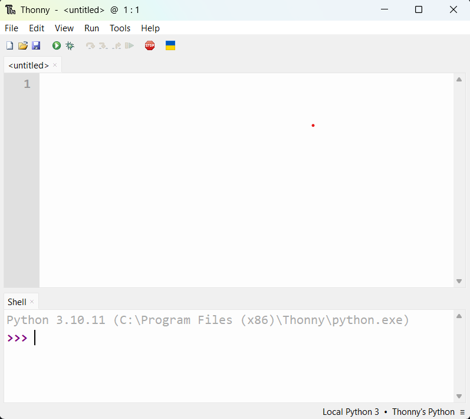

# Setup: RPI-CAN IO Board

This guide walks you through setting up your RPI-CAN board for use with the hermes project.

## Hardware Needed
- RPI-CAN controller board
- Power supply
- CAN bus wiring
- (Optional) Example device: LED strip

## 1. Establish common ground
The control board, the external power supply (if using one), and the device you are controlling all need to share a common ground. Wire these GND's together.

## 2. Isolate power
If using an external power supply to power the device you are controlling, isolate the power of that device from the control board to prevent damage to the control board. Keep those wires tidy!

## 3. Download and install Thonny IDE
Go to [Thonny's website](https://thonny.org/) to download and install the Thonny IDE. In the upper right corner of the website, you will find links to download the installer for either Windows, Mac, or Linux OS.

Once installed, open Thonny on your PC.

You should see a main programming window in the upper section of the app, and a shell in the lower section of the app.

## 4. Connect the board to your PC
Using a USB-C cable, connect your PC to the RP2350-CAN board. If the bottom right corner of Thonny still shows "Local Python", you need to install MicroPython on the board. However, if the bottom right corner of Thonny shows "MicroPython... @ COM(some number)", then skip step 5 and proceed with programming.

## 5. (if required) Install MicroPython on the board
With the board connected to your PC, hold down the BOOT button on the board, then press the RESET button, and release both buttons.

The board should now mount to your PC as a USB storage device. If it doesn't, disconnect the board. Then while pressing BOOT, reconnect the board to the PC. Now you should see the USB drive show up as "RP2350".

You now need to put the MicroPython firmware onto that drive so the board knows how to run your code.

**Important:** Use Waveshare's custom MicroPython firmware, NOT the official MicroPython firmware. The official version has USB recognition issues with this board.

1. **Download Waveshare's MicroPython firmware** Go to: https://www.waveshare.com/wiki/RP2350-CAN#Flash_Firmware.
Download the "Pico2 firmware library". Unzip the file and save the .uf2 file somewhere convenient.

2. **Install MicroPython**  Drag and drop the downloaded .uf2 file onto the RP2350 drive.
The drive will automatically disconnect.

3. **Verify the installation**  Open Thonny IDE. In the bottom-right corner, click on the interpreter selector. Choose "MicroPython (RP2040)" or "MicroPython (RP2350)" and select the COM port. You should see a >>> prompt in the Shell window.

You are now ready to program the controller!

---

## Next Steps
- [How It Works](architecture.md)
- [How to Use](usage.md)
